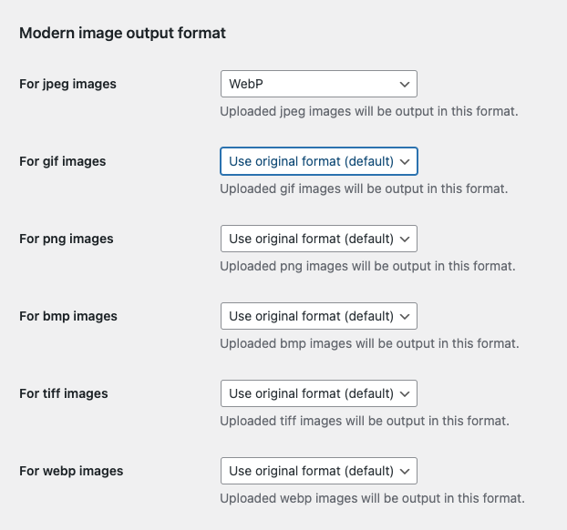
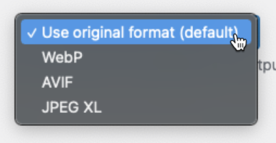

# Modern Images for WordPress

Specify the default image format used for sub-sized images generated by WordPress.

## Technical Notes

* Requires PHP 5.6+.
* Requires WordPress 5.8+.
* [Issues](https://github.com/adamsilverstein/modern-images-wp/issues) and [Pull Requests](https://github.com/adamsilverstein/modern-images-wp/pulls) welcomed.

## Screenshots

1. Modern image output format options on `Settings` > `Media` admin page.

2. Image format options available for various image types.

